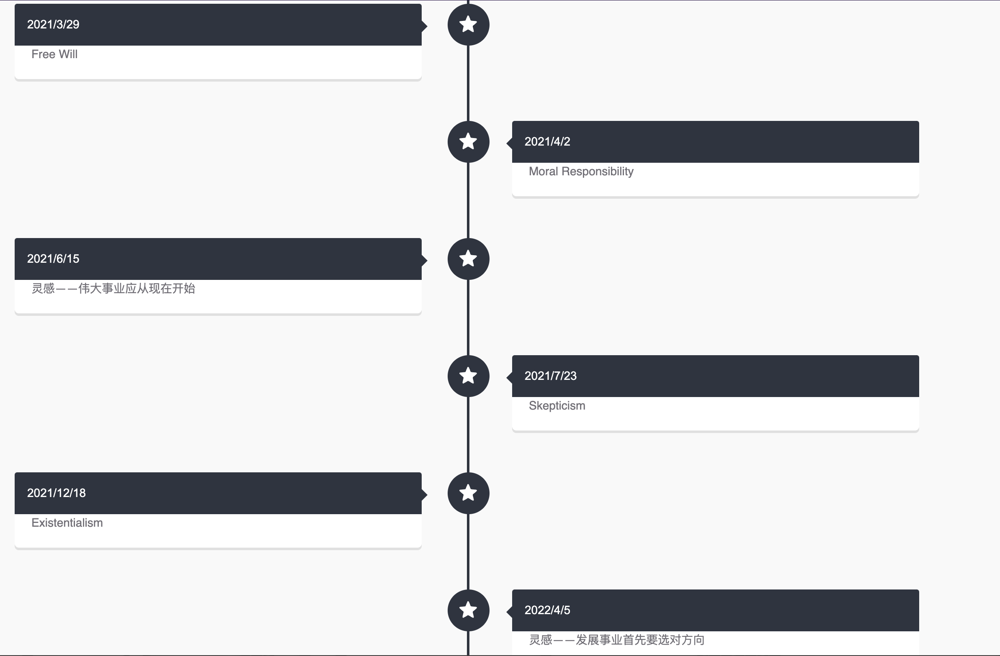
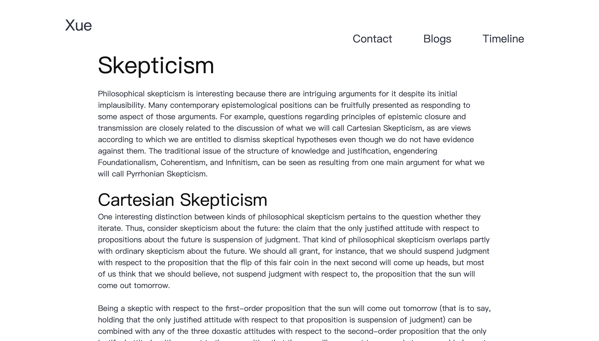

# X Blog

个人博客静态网站项目，基于获取 Markdown 文件的内容，解析后渲染到新页面，同时支持时间线视图功能，方便管理与展示博文。
Markdown 文件使用 [marked.js](https://marked.js.org) 解析，并使用 [highlight.js](https://highlightjs.org) 和 [katex](https://katex.org) 支持代码高亮和数学公式。

## 展示

主页动画

博文的时间线视图

博文页面示例

## 用法

1. 在 `./assets/blogs` 里面放入 Markdown 文件
2. 修改 `blogs.json`

这样就在 `./pages/blogs.html` 页面创建索引了, 同时 `./pages/timeline.html` 也能生成时间线。
 `./templates/blog-template.html` 是博客模板，`./assets/css/template.css` 是博客模板的 CSS文件。

## 注意

尚未部署到服务器，可以使用 VSCode 编辑器的 `Live Server` 插件查看效果。

## 致谢

本项目是北京大学 JavaScript 及 Web 网页前端开发 (2022年春季学期) 的期末作业。
感谢小组同学提供的项目思路和课程团队提供的评分支持。
本人负责代码库中的主页动画和时间线视图。
